#  Uber Business Trip Insights

##  Project Overview
This project performs Exploratory Data Analysis (EDA) on Uber trip data from 2016 using Python, Pandas, and Matplotlib. The goal is to uncover business travel patterns and provide actionable business decisions for cost optimization and resource planning.

## Dataset
- **Source:** Uber Dataset (2016)
- **Records:** 1,156 trips
- **Columns:** START_DATE, END_DATE, CATEGORY, START, STOP, MILES, PURPOSE

##  Tools Used
- Python
- Pandas
- Matplotlib
- Jupyter Notebook

---

##  Step 1 — Data Loading & Exploration

```python
import pandas as pd
df = pd.read_csv("UberDataset.csv")
df.head()
df.info()
```


---

##  Step 2 — Data Cleaning

###  Before Cleaning — Missing Values

```python
df.isnull().sum()
```

| Column | Null Count |
|---|---|
| START_DATE | 0 |
| END_DATE | 1 |
| CATEGORY | 1 |
| START | 1 |
| STOP | 1 |
| MILES | 0 |
| PURPOSE | 503 |

>  PURPOSE column has 503 missing values — almost 43% of total data!

###  After Cleaning — Filling Empty Values

```python
# Fill missing PURPOSE with 'Unknown'
df["PURPOSE"] = df["PURPOSE"].fillna("Unknown")

# Verify — should return 0
df["PURPOSE"].isnull().sum()
```

> All 503 empty PURPOSE values are now labeled as **"Unknown"** — no data is lost, and analysis remains accurate 

### ⏱️ Creating New Columns

```python
# Convert dates to datetime
df['START_DATE'] = pd.to_datetime(df['START_DATE'], errors='coerce')
df['END_DATE'] = pd.to_datetime(df['END_DATE'], errors='coerce')

# Create Duration column (in minutes)
df['DURATION_MIN'] = (df['END_DATE'] - df['START_DATE']).dt.total_seconds() / 60
df['DURATION_MIN'] = df['DURATION_MIN'].astype(int)

# Extract time features
df['MONTH'] = df['START_DATE'].dt.month
df['DAY'] = df['START_DATE'].dt.day_name()
df['HOUR'] = df['START_DATE'].dt.hour.astype(int)
```

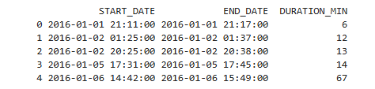


###  Explanation

- Converted `START_DATE` and `END_DATE` into datetime format  
- Created `DURATION_MIN` to calculate trip duration  
- Extracted `MONTH`, `DAY`, and `HOUR` for time analysis  

###  Insight

- Trips have different durations (short & long rides)  
- Time features help find peak hours and busy days  

###  Business Use

- Identify peak travel time  
- Improve driver availability  
- Optimize business decisions  
---

##  Step 3 — Analysis & Visualizations

###  Business vs Personal Trips

```python
df["CATEGORY"].value_counts()
df["CATEGORY"].value_counts().plot(kind="bar")
plt.title("Uber Trip Category")
plt.xlabel("Category")
plt.ylabel("Count")
plt.show()
```

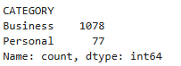

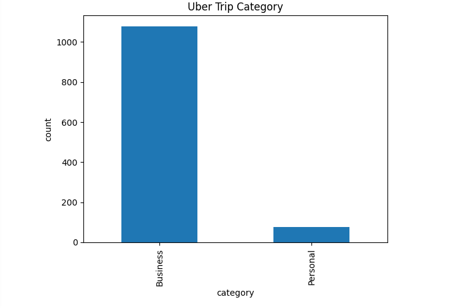

**Business Decision:**
> 93% of trips are Business trips. Company should open a dedicated corporate Uber account to manage and reduce travel expenses efficiently.

---

###  Trip Purpose Distribution

```python
df["PURPOSE"].value_counts()
df["PURPOSE"].value_counts().plot(kind="bar")
plt.title("Uber Trip Purpose")
plt.xlabel("Category")
plt.ylabel("Count")
plt.show()
```

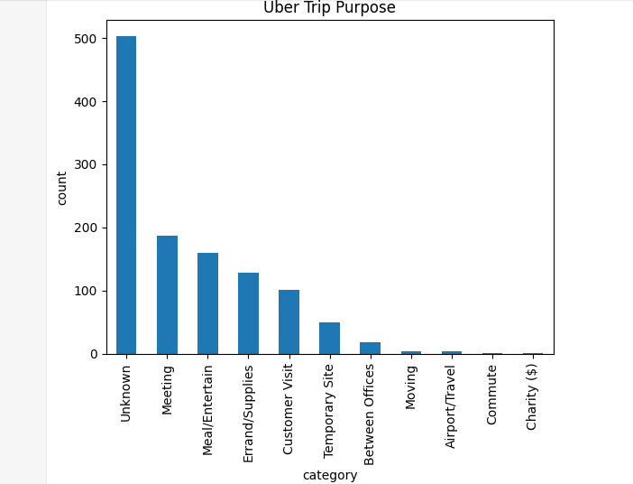

** Business Decision:**
> Meeting is the most common trip purpose (187 trips). Company can reduce costs by encouraging virtual meetings for short-distance travel.

---

###  Trips per Month

```python
df['MONTH'].value_counts().sort_index().plot(kind='bar')
plt.title("Trips per Month")
plt.xlabel("Month")
plt.ylabel("Number of Trips")
plt.show()
```

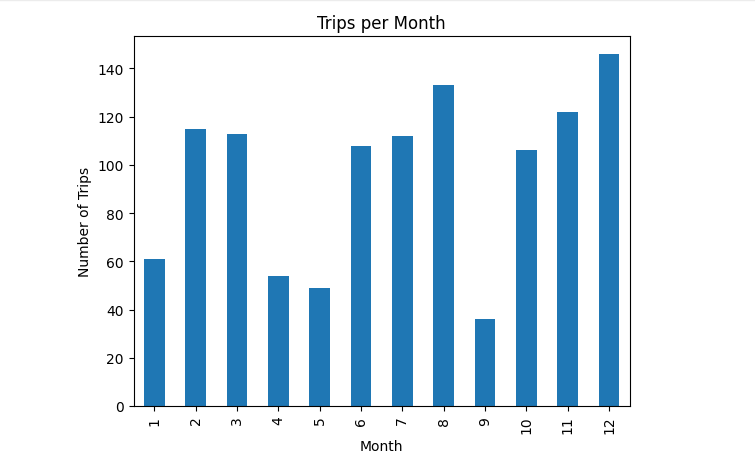

** Business Decision:**
> December has the highest trips (145). Company should plan travel budget allocation for peak months — August, December, and November.

---

###  Outlier Detection — Miles > 100

```python
df[df["MILES"] > 100]
```

>  Row 1155 shows 12,204 miles — a data error (Totals row). This outlier was filtered out before plotting the distribution chart.

---

###  Miles Distribution

```python
import matplotlib.pyplot as plt
plt.figure(figsize=(8,5))
df[df['MILES'] < 100]['MILES'].plot(kind='hist', bins=30,
                                    color='steelblue', edgecolor='black')
plt.title('Miles Distribution (Under 100 miles)')
plt.xlabel('Miles')
plt.ylabel('Frequency')
plt.tight_layout()
plt.show()
```

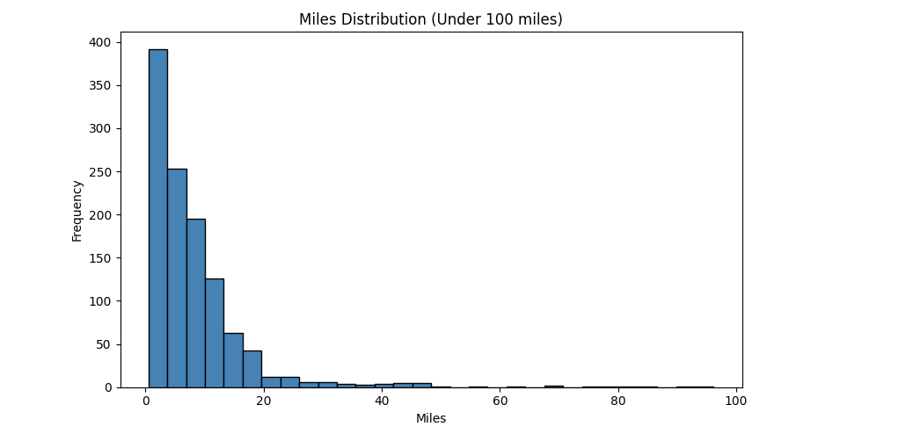

 Business Decision:
> Most trips are under 10 miles. Company should consider cab pooling or alternative transport for very short trips to save cost.

---

###  Trips by Hour of Day

```python
df['HOUR'].value_counts().sort_index().plot(kind='bar', color='orange')
plt.title("Trips by Hour")
plt.xlabel("Hour")
plt.ylabel("Count")
plt.show()

hour_counts = df['HOUR'].value_counts().sort_index()
print(hour_counts)
```

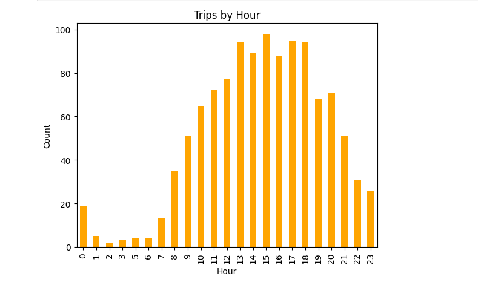

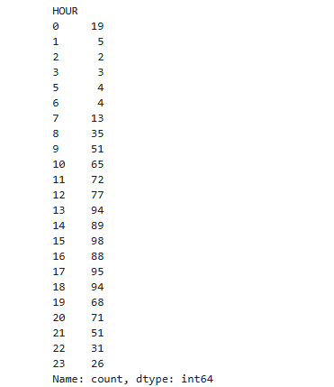

** Business Decision:**
> Peak hours are 1 PM – 6 PM (Hour 13–18). Company should pre-book Uber during these hours to avoid surge pricing and reduce employee wait time.

---

###  Trips by Day of Week

```python
df['DAY'] = df['START_DATE'].dt.day_name()
day_order = ['Monday','Tuesday','Wednesday','Thursday','Friday','Saturday','Sunday']
day_counts = df['DAY'].value_counts().reindex(day_order)

plt.figure(figsize=(8,5))
day_counts.plot(kind='bar', color='steelblue', edgecolor='black')
plt.title('Trips by Day of Week')
plt.xlabel('Day')
plt.ylabel('Number of Trips')
plt.show()
```

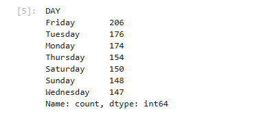

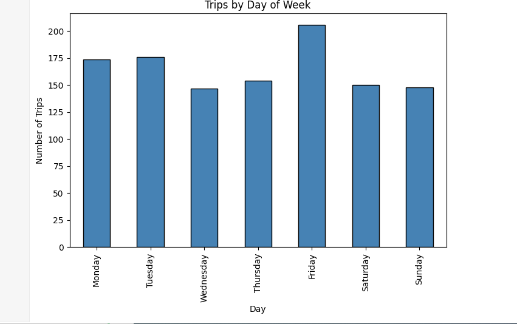

** Business Decision:**
> Friday has the most trips (206). Company should ensure maximum Uber availability on Fridays and pre-schedule rides for regular Friday meetings.

---

###  Average Miles per Trip Purpose

```python
avg_miles = df.groupby('PURPOSE')['MILES'].mean().sort_values(ascending=False)
print(avg_miles)

avg_miles.plot(kind='barh', color='steelblue', edgecolor='black')
plt.title('Average Miles per Trip Purpose')
plt.xlabel('Average Miles')
plt.ylabel('Purpose')
plt.tight_layout()
plt.show()
```

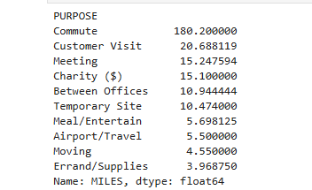

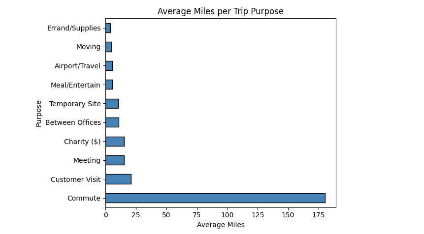

** Business Decision:**
> Commute trips average 180 miles — the highest of all purposes. Company should negotiate special long-distance corporate rates with Uber for commute and customer visit trips.

---

###  Total Miles — Business vs Personal

```python
total_miles = df.groupby('CATEGORY')['MILES'].sum()
print(total_miles)

total_miles.plot(kind='bar', color=['steelblue','orange'], edgecolor='black')
plt.title('Total Miles - Business vs Personal')
plt.xlabel('Category')
plt.ylabel('Total Miles')
plt.tight_layout()
plt.show()
```

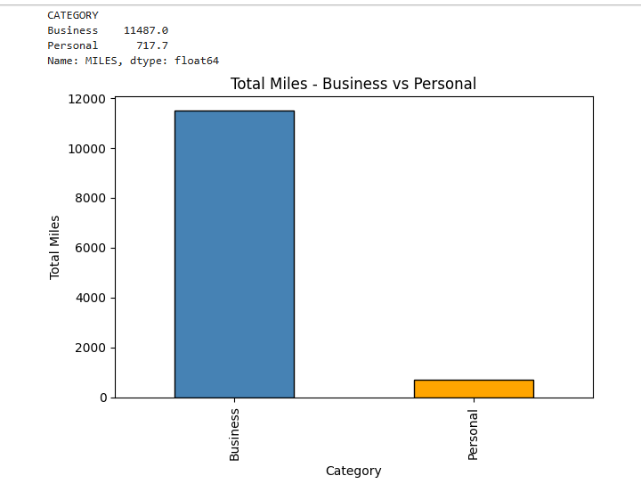

 Business Decision:
> Business trips account for 11,487 miles (94% of total). A dedicated Uber for Business account with bulk mileage plans would significantly cut travel costs.

---

##  Key Business Recommendations

| Finding | Recommendation |
|---|---|
| 93% Business trips | Open corporate Uber account |
| Peak hours 1 PM – 6 PM | Pre-book to avoid surge pricing |
| Friday most trips (206) | Pre-schedule Friday rides |
| Most trips under 10 miles | Consider cab pooling |
| Customer Visit — long distance | Negotiate bulk rates |
| 43% Unknown purpose | Mandate trip purpose entry |
| Dec & Aug peak months | Plan travel budget accordingly |


